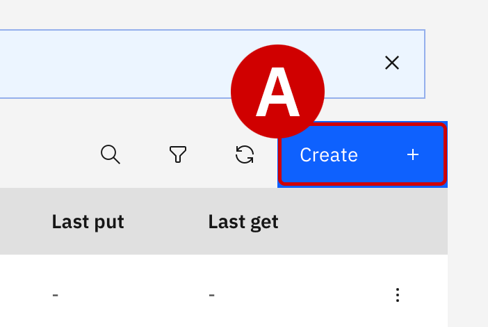
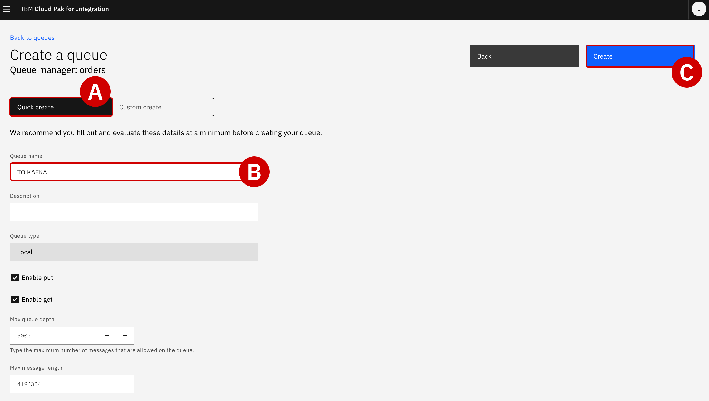
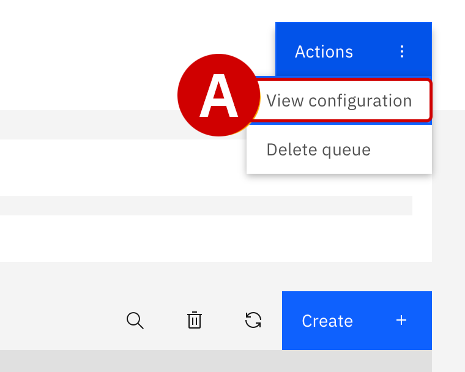

#

!!! quote ""
    Christopher Bienko *(Principal, IBM Global Sales Enablement)* provides a hands-on demonstration of Module 1.

    **Additional ways to watch:** <a href="https://ibm.seismic.com/Link/Content/DC4cQH44328qqGFWgD89HPjF9Xgj" target="_blank">Seismic replay available for download.</a> [8 minutes]

<br/>

## **i. Creating an event stream from an IBM MQ message queue**

To take advantage of the message queue data available from IBM MQ, Focus Corporation's integration team will need to make IBM MQ's enterprise data available to a broader set of APIs. This will allow Focus' application developers to subscribe to the data without any risk or impact to the core back-end systems that support the data. Risks will be lowered and the application development process can be decoupled from data retention processes.

To do so, Focus' integration team will need to expose the IBM MQ enterprise data using "event streams." Specifically, the integration team (and application developers) will need access to the customer order information contained within these streams. This data will be vital for the marketing team's plans to offer high value promotions for newly-acquired customers in a timely manner.

---

## **ii. Configuring IBM MQ to clone customer order data**

Both the order management system and its payment gateway system are currently using IBM MQ message queues for exchanging customer order data. The integration team will need to tap into this message exchange, clone each of the orders being handled across IBM MQ, and then publish those messages into a new event stream.

---

1. Open the **IBM Cloud Pak for Integration Platform Navigator** dashboard with a web browser.

    - From the home page, open the **Orders** queue manager
	- From the left-hand side interface, drill down into the **Manage**^[A]^ tab

    <br/>
    {: loading=lazy width="600"}
    {: loading=lazy width="600"}

---

2. Select the **Queues**^[A]^ tab along the top of the page.

    <br/>
    {: loading=lazy width="600"}

---

3. Scroll down the page until you reach a table, which at this time should show several queues that are already a part of the environment.

	Create a new queue by clicking the blue **Create**^[A]^ icon in the top-right corner of the table.

    <br/>
    {: loading=lazy width="200"}

---

4. Wait for the Queue creation wizard to load, then select **Local**^[A]^ from *Choose queue type*.


    <br/>
    {: loading=lazy width="500"}

---

5. The **Quick create**^[A]^ option should be selected by default.

	- Under the **Queue name**^[B]^ field, enter `TO.KAFKA` (all uppercase)
    - Leave all other settings configured to their default values
    - When ready, click **Create**^[C]^
	- The web browser will refresh back to the **Manage** > **Queues** perspective
    - From the Queues table, confirm that the `TO.KAFKA` queue is now available


    <br/>
    {: loading=lazy width="600"}

---

Next, you need to configure IBM MQ to clone all customer order data that it is exchanging between Focus Corporation's order management system and payment gateway. Messages must be reviewed to verify that they contain the expected payload information.

---

6. From the **Manage** > **Queues** table, locate the queue named `PAYMENT.REQ` and click the **name**^[A]^ to inspect it in more detail.


    <br/>
    {: loading=lazy width="600"}

---

7. The queue will already have been populated with multiple *Messages*. Click on any of the **Timestamp**^[A]^ names available in the table (something similar to `Feb 21, 2024 at 5:12:00 PM`) to pull open a *Message Details* panel.

	- Scroll down the *Message Details* panel until you reach **Application Data**^[B]^
    - Inspect the contents of the packet, which is a series of key-value pairs: you should see details about the order `id`, `customer`, `customerid`, `description`, `price`, `quantity`, `region`, and `ordertime`
    - **Close**^[C]^ the *Message Details* panel by clicking the `X` in the top-right corner or the grey `Close` button


    <br/>
    {: loading=lazy width="600"}

---

8. Back on the `PAYMENT.REQ` orders summary table, locate the **Actions** button in the top-right corner of the page. Click to open a drop-down menu and then select **View configuration**^[A]^.


    <br/>
    {: loading=lazy width="200"}

---

9. Multiple attributes of the `PAYMENT.REQ` order queue can be configured from this page.

	Click the grey **Edit**^[A]^ button to the right side of the *General* page.

    <br/>
    {: loading=lazy width="600"}

---

10. From the tabs on the left side of the page, drill down into **Storage**^[A]^.

	- Scroll down until you reach the **Streaming queue name**^[B]^ field and change the value to `TO.KAFKA`
    - This will direct IBM MQ to clone messages from the `PAYMENT.REQ` queue into the `TO.KAFKA` streaming queue created in *Step 5*
    - When satisfied, click the blue **Save**^[C]^ button in the top-right of the page to confirm the configuration changes

    <br/>
    {: loading=lazy width="600"}

---

11. Once confirmed, the new configuration will immediately take effect and cloned order messages will promptly begin filling the `TO.KAFKA` queue.

	- Scroll back up to the top of the page and locate the blue **Manage**^[A]^ text in the top-left corner of the screen
    - Click the text to return back to the *Manage* page for `Orders`
    - From the tabs along the top of the page, click the **Queues** tab
    - From the table of queues, drill down into the **TO.KAFKA** queue

    <br/>
    {: loading=lazy width="300"}

---

12. Take note of the customer order messages that are now populating the `TO.KAFKA` message queue table. You can click the circular refresh icon (to the left of the blue *Create* button) to reload the queue contents.

---

## **iii. Cloning order queues with IBM Event Streams**

Focus Corporation's integration team will now need to create an event stream called `Orders` using *IBM Event Streams*. This will serve as the repository where messages, cloned from IBM MQ, are published and made available to other parts of the organization.

The integration team will need to make decisions about how to replicate the data (with or without modification) and also determine the appropriate retention settings for this data. Given the governance policies in place at Focus Corporation, they will need to retain data for up to 1 week and replicate entries for high availability.

!!! note "MQ-KAFKA CONNECTOR"

    **IBM MQ** allows applications, systems, services, and files to request and coordinate processing tasks — sending and receiving message data via messaging queues. **IBM Event Automation**'s Kafka integrations makes it possible to capture a continuous stream of events, representing state changes across one or multiple environments, and makes those events persistently available for retrieval.

    In combination, IBM MQ and Event Automation enable business-critical communications originating over MQ to be captured as events within Kafka topics, which can later be shared across the enterprise for fueling more responsive applications. IBM MQ-Kafka connectors support bi-directional connectivity between these two architectures. Clients of IBM Event Automation are fully supported for using MQ-Kafka connectors with the Event Streams capability of the platform. Support for the MQ-Kafka connector is also available for IBM clients with MQ Advanced entitlements.

---

13. Open the **IBM Event Streams** tab using your web browser.

---

14. From the *IBM Event Streams* dashboard, click the **Create a topic**^[A]^ tile.

    <br/>
    {: loading=lazy width="600"}

---

15. The team must first decide on a **Topic Name**^[A]^.

	Set the value to `ORDERS` and then click the blue **Next**^[B]^ button to continue.

    <br/>
    {: loading=lazy width="600"}

---

16. Under the **Patitions** tab, accept the default recommendation of `1` by clicking **Next**^[A]^.

    <br/>
    {: loading=lazy width="600"}

---

17. Under the **Message Retention** tab, accept the default recommendation^[A]^ of `A week` and click **Next**^[B]^ to continue.

    <br/>
    {: loading=lazy width="600"}

---

18. Under the **Replicas** tab, accept the default recommendation^[A]^ of `Replication factor: 3`  and confirm your selections by clicking the **Create Topic**^[B]^ button.

    <br/>
    {: loading=lazy width="600"}

---

## **iv. Configuring a message bridge between IBM MQ and IBM Event Streams**

Using the Apache Kafka connector framework, Focus Corporation's integration team will now need to configure an "event bridge" using Red Hat OpenShift. The task can be performed programmatically via the OpenShift console. The bridge configuration will include connectivity details for accessing both IBM MQ and IBM Event Streams.

Once configured and deployed, the bridge will utilize the Apache Kafka connector framework to read messages from the `TO.KAFKA` *message queue* and then publish those to the newly-created `Orders` *event stream*.

---

19. Return to the OpenShift container platform dashboard.

	From the **Home** page, click the **+**^[A]^ icon located in the top-right corner of the interface.

    <br/>
    {: loading=lazy width="600"}

---

20. The interface will load an **Import YAML** configuration tool, with a black canvas awaiting input. Here you can supply *YAML* (Yet Another Markup Language) or *JSON* files to define new deployments on the OpenShift cluster.

	The YAML definition of the Apache Kafka connector "bridge" has been prepared ahead of time. Copy and paste the following YAML *exactly* as written into the **Import YAML** canvas:

``` yaml
apiVersion: eventstreams.ibm.com/v1beta2
kind: KafkaConnector
metadata:
  name: mq-connector
  namespace: tools
  labels:
    eventstreams.ibm.com/cluster: jgr-connect-cluster
spec:
  class: com.ibm.eventstreams.connect.mqsource.MQSourceConnector
  tasksMax: 1
  config:
    # the Kafka topic to produce to
    topic: ORDERS
    # the MQ queue to get messages from
    mq.queue: TO.KAFKA
    # connection details for the queue manager
    mq.queue.manager: orders
    mq.connection.name.list: orders-ibm-mq(1414)
    mq.channel.name: SYSTEM.DEF.SVRCONN
    # format of the messages to transfer
    mq.message.body.jms: true
    mq.record.builder: com.ibm.eventstreams.connect.mqsource.builders.JsonRecordBuilder
    key.converter: org.apache.kafka.connect.storage.StringConverter
    value.converter: org.apache.kafka.connect.json.JsonConverter
    # whether to send the schema with the messages
    key.converter.schemas.enable: false
    value.converter.schemas.enable: false
```

<br/>

When ready, click **Create**^[A]^. Full deployment should only take a moment.

<br/>
{: loading=lazy width="600"}


---

21. Switch over to the **IBM Event Streams** tab with your web browser. Having configured the streaming queue in IBM MQ (earlier in Step 18), Focus Corporation's integration team now wants to view the orders that have been generated so far.

	From the home dashboard of the IBM Event Streams service, click the **Topic**^[A]^ tab (left-hand side) and then click on the name `ORDERS` from the table.

    <br/>
    {: loading=lazy width="600"}

---

22. Granular details about the `ORDERS` topic will be loaded within the browser. From this page, you can inspect all of the messages (orders) generated from the time you set up the IBM MQ streaming queue configuration earlier.

    - Click any one of the orders to pull up additional details on the payload and its contents
    - Note that you can inspect details about the `quantity`, `price`, `customerid`, `description`, `id`, `region`, `ordertime`, and `customer`

    <br/>
    These fields will be valuable later for the marketing team as they look to perform outreach on customers meeting certain criteria.

---

23. Switch back to the **IBM Event Streams** dashboard^[A]^ and click **Connect to this cluster**^[B]^.

    <br/>
    {: loading=lazy width="600"}

---

24. Details about your Kafka cluster, including the URL are authentication details, are summarized on this page.

    - Open the **Internal** tab^[A]^
    - Record the `Kafka SCRAM URL` to a notepad for reference later^[B]^
    - Click **Generate SCRAM credentials**^[C]^

    <br/>
    {: loading=lazy width="600"}

---

25. To connect securely to IBM Event Streams, your application needs credentials with permissions set appropriately for accessing cluster resources (such as Topics).

    - *Credential name*^[A]^ should be set to `es-demo`
    - *What do you want your application to do?*^[B]^ set to `Produce messages, consume messages and create topics and schemas`
    - **Next** ^[C]^ to continue

    <br/>
    {: loading=lazy width="600"}

---

26. Select *All Topics* and click **Next**.

---

27. Select *All consumer groups* and click **Next**.

---

28. Select *No transactional IDs*^[A]^ and click **Generate credentials**^[B]^ to continue.

    <br/>
    {: loading=lazy width="600"}

---

29. Record the `SCRAM username`^[A]^ and `SCRAM password`^[B]^ values to a notepad for future reference.

    <br/>
    {: loading=lazy width="600"}

---

## **v. Next steps**

In the following module, the integration team will use *IBM Event Endpoint Management* to import the event stream data and curate a self-service catalog for the marketing department.