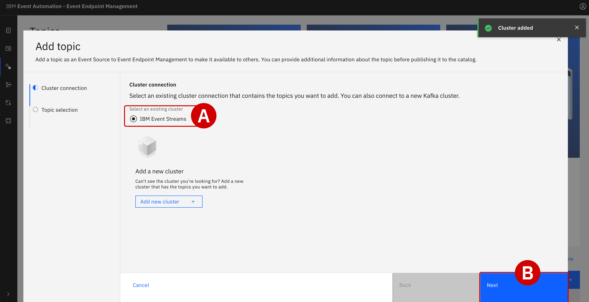
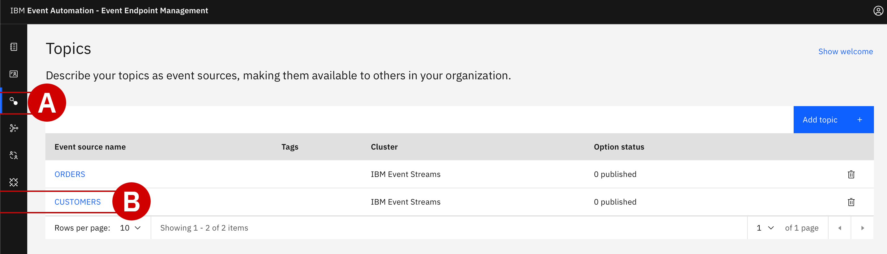
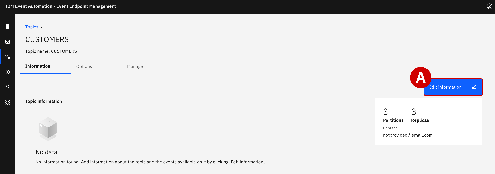

#

!!! quote ""
    Christopher Bienko *(Principal, IBM Global Sales Enablement)* provides a hands-on demonstration of Module 2.

    **Additional ways to watch:** <a href="https://ibm.seismic.com/Link/Content/DCCH9WJ36CWTJG9Bj34WjDFTq9VB" target="_blank">Seismic replay available for download.</a> [9 minutes]

<br/>

## **i. Build a self-service catalog with Event Endpoint Management**

Having successfully deployed the IBM MQ-Apacha Kafka connector framework, Focus Corporation's integration team have created a bridge between MQ and Event Streams. As new customer order data is processed by the IBM MQ message queue, it is simultaneously cloned into the `Orders` event stream — awaiting further analysis and action by other users downstream.

In this module, Focus' integration team will utilize **IBM Event Endpoint Management (EEM)** to import the newly-created event stream into a self-service catalog. EEM supports two use cases: the first is allowing teams (like the integration squad) to publish new event streams; the second is for consumers (such as marketing) to browse the contents of those event streams, without requiring direct intervention from the integration team.

!!! note "WHAT IS THE DIFFERENCE BETWEEN OpenAPI and AsyncAPI?"

    OpenAPI and AsyncAPI both represent formalized specifications for describing APIs, but the data source feeding these APIs and the style in which that data is communicated differs between the two. **This is important in the context of IBM Event Endpoint Management.**

    - **OpenAPI** is designed for describing RESTful API endpoints, focusing on synchronous client-server communication: a client sends a request and waits for a direct response from a server. Therefore, OpenAPI is well-suited for standard web services where a client interacts with a server in a request-response model.

    - **AsyncAPI** is built for working with event-driven, asynchronous APIs that rely on asynchronous communication patterns: publish and subscribe, event streaming, and message-driven APIs. It is well-suited for Internet of Things (IoT) applications, real-time data processing use cases, or other scenarios where communication doesn't follow the typical direct request-response (synchronous and RESTful) API pattern.

    Put simply, the key difference between the two is their differing communication patterns. OpenAPI is designed for synchronous messaging (following the request-response pattern) and AsyncAPI is intended for asynchronous communication (event-driven) patterns.
    
    IBM Event Endpoint Management— a composable service within IBM Event Automation —uses AsyncAPI as the standardized way for describing event-driven messages. It allows clients to quickly "discover" events across their ecosystem, publish those events across the organization according to governance rules that ensure compliance, and create enforceable policies through event gateways. Like enterprises do today with API gateways, an event gateway provides isolation, abstraction, policy enforcement, and decoupling to asynchronous (event-driven) data sources.

---

## **ii. Defining new Topics within IBM Event Streams**

Before the event stream data can be browsed as part of a self-service catalog, the integration team must first import into EEM the `ORDER` and `CUSTOMER` streams via *Topics* created earlier within IBM Event Streams.

---

1. Since this is the first time that the integration team has needed to import Topics from IBM Event Streams, they must first register the cluster within IBM Event Endpoint Manager (EEM):

    - Switch over to the EEM tab within your web browser

    - Click the *Hide Welcome*^[A]^ text to collapse the tutorials at the top of the page

    - From the left-hand side of the interface, click **Topic**^[B]^

    <br/>
    {: loading=lazy width="600"}

---

2. From the right side of the interface, click the blue **Add Topic** button. A configuration tool for importing a Topic into EEM will load.

    - *Interaction* settings: Click the **Consume events**^[A]^ and then **Next** to proceed
    
    - *Cluster connection* settings: Click the **Add new cluster**^[B]^ button

    <br/>
    {: loading=lazy width="600"}
    
    {: loading=lazy width="600"}

---

3. Set the *Cluster Name*^[A]^ variable to `IBM Event Streams` and click **Next**^[B]^ to continue.

    <br/>
    {: loading=lazy width="600"}

---

4. Additional details about the connection are required: the endpoint address, certificates required for secure communication with the cluster, and authentication credentials.

    - Set the *Servers*^[A]^ variable to the `Kafka SCRAM URL` that you copied in *Module 1 - Step 24* (likely `es-demo-kafka-bootstrap.tools.svc:9095`)
    
    - Click **Next**^[B]^ to continue

    <br/>
    {: loading=lazy width="600"}

---

5. Click (to add a checkmark) on the **Accept all certificates**^[A]^ toggle, then click **Next**^[B]^.

    <br/>
    {: loading=lazy width="600"}

    {: loading=lazy width="600"}

---

6. Next, configure details regarding *Credentials*.

    - The *Security Protocol* field should remain at the default value of `SCRAM-SHA-512`

    - *Username*^[A]^ should be set to `es-demo` (*Module 1 - Step 29*)

    - *Password*^[B]^ must match the value recorded in *Module 1 - Step 29*

    - When ready, click **Add Cluster**^[C]^

    <br/>
    {: loading=lazy width="600"}

---

7. The web browser will return to the *Add Topic* configuration page from Step 2.

    - Under the *Cluster connection*^[A]^ header, select the `IBM Event Streams` connection defined earlier
    
    - When ready, click **Next**^[B]^

    <br/>
    {: loading=lazy width="600"}

---

8. Now select the Topics that will be made available for browsing within the Event Endpoint Management catalog.

    - Toggle (select) *both* the `CUSTOMERS`^[A]^ and `ORDERS`^[B]^ topics
    
    - Keep the alias values set to their recommended defaults

    - When ready, click **Add Topic**^[C]^

    <br/>
    {: loading=lazy width="600"}

---

## **iii. Defining a data schema for *Customers***

With the connections to IBM Event Streams defined and the Kafka Topics selected for replication, Focus' integration team is ready to create self-service event stream catalogs within EEM. 

The team must provide descriptions of the event streams, including an example of how the data is structured and formatted. This description will be beneficial to other individuals within the company (such as the marketing department), who will want to know at-a-glance whether a particular Topic catalog fits their needs.

---

9. From the EEM dashboad, drill down into **Topics**^[A]^ as before and click the name of the `CUSTOMERS`^[B]^ topic.

    <br/>
    {: loading=lazy width="600"}

---

10. Click the blue **Edit information**^[A]^ on the right-hand side of the page.

    <br/>
    {: loading=lazy width="600"}

---

11. Within the *Overview information* tab:

    - Scroll down until you reach the **Description**^[A]^ field and enter the following text: `Events generated by the customer management system. A new event is created for each new user registration.`

    - Scroll further down until you reach the **Tags**^[B]^ field and enter `customer`

    - For the **Contact Email**^[C]^ field, enter `customerservice@focus.corp`

    - Click the **Event Information**^[D]^ tab from the left side of the interface
    
    - **DO NOT CLICK *SAVE*** — if you _did_ click save, return to the previous screen by clicking the **Edit information** button again

    <br/>
    {: loading=lazy width="600"}

---

12. Within the *Event information*^[A]^ tab, scroll down until you locate the **Sample message**^[B]^ field. Here you will provide a representation of a typical message on the `CUSTOMERS` event stream.

    - Set the *Message Format* type to `JSON`
    
    - Copy and paste the following JSON into the *Sample message* field:

    ``` json
    {
    "customerid": "acb3eb65-98a1-45c2-84d4-f5df157862b4",
    "customername": "Emilio Quitzon",
    "registered": "2023-10-24 19:20:35.638"
    }
    ```
    
    <br/>

    - When ready, click **Save**^[C]^ to finalize both the *Overview Information* and *Event Information* configuration settings

    <br/>
    {: loading=lazy width="600"}

---

13. The web browser will return to the `CUSTOMERS` Topic overview.

    - From the three tabs at the top of the screen, click **Options**^[A]^

    - Click the blue **Create Options**^[B]^ button

    <br/>
    {: loading=lazy width="600"}

---

14. Within the *Details* tab, provide the following customizations:

    - **Order name**^[A]^: `Customer Access`

    - **Alias**^[B]^: `CUSTOMERS`

    - **Description**^[C]^: `Self-service access to the customer event stream`

    When ready, click **Next**^[D]^.

    <br/>
    {: loading=lazy width="600"}

---

15. Leave the *Controls* tab empty (`No data`) and click **Save**^[A]^.

    <br/>
    {: loading=lazy width="600"}

---

16. The *Publish option* tab will give you a final opportunity to review the `CUSTOMERS` topic before publishing for other users of EEM.

    - Within the blue *Option Status* field, click the **Publish**^[A]^ button

    - Further down the panel, under the *Available gateways*^[B]^ field, verify that the `egw-group` option is pre-selected

    - When ready, click **Publish**^[C]^ to finalize publication of the `CUSTOMERS` topic

    <br/>
    {: loading=lazy width="600"}

    {: loading=lazy width="600"}

    {: loading=lazy width="600"}

---

## **iv. Defining a data schema for *Orders***

The process of publishing an event streams Topic within EEM (Steps 9–16) must now be repeated— with some slight modifications —for the `ORDERS` topic.

---

17. From the EEM dashboard, drill down into **Topics**^[A]^ and then click the name `ORDERS`^[B]^.

    <br/>
    {: loading=lazy width="600"}

---

18. Click on the **Edit information** button.

---

19. Within the *Overview information* tab:

    - Scroll down until you reach the **Description**^[A]^ field and enter the following text: `Events generated by the customer management system. An event will be emitted for every new order that is made.`

    - Scroll further down until you reach the **Tags**^[B]^ field and enter `orders`

    - For the **Contact Email**^[C]^ field, enter `orders@focus.corp`

    - Click the **Event Information**^[D]^ tab from the left side of the interface
    
    - **DO NOT CLICK *SAVE*** — if you _did_ click save, return to the previous screen by clicking the **Edit information** button again

    <br/>
    {: loading=lazy width="600"}

---

20. Within the *Event information* tab, scroll down until you locate the **Sample message**^[A]^ field. Here you will provide a representation of a typical message on the `ORDERS` event stream.

    - Set the *Message Format* field to `JSON`

    - Copy and paste the following JSON into the *Sample Message* field:

    ``` json
    {
    "quantity": 9,
    "price": 197.09,
    "customerid": "a7d1586b-ced1-462f-9e44-14e9e5013540",
    "description": "Composite Oversize 28in Tennis Racket",
    "id": "1eba7af9-b748-4754-b750-3459e589dccf",
    "region": "EMEA",
    "ordertime": "2023-10-24 19:26:04.839",
    "customer": "Reed McKenzie DDS"
    }
    ```

    <br/>

    - When ready, click **Save**^[B]^ to finalize both the *Overview Information* and *Event Information* configuration settings

    <br/>
    {: loading=lazy width="600"}

---

21. The web browser will return to the `ORDERS` Topic overview.

    - From the three tabs at the top of the screen, click **Options**^[A]^

    - Click the blue **Create Options**^[B]^ button

    <br/>
    {: loading=lazy width="600"}

---

22. Within the *Details* tab, provide the following customizations:

    - **Order name**^[A]^: `Order Access`

    - **Alias**^[B]^: `ORDERS`

    - **Description**^[C]^: `Self-service access to the order event stream`

    When ready, click **Next**^[D]^.

    <br/>
    {: loading=lazy width="600"}

---

23. Leave the *Controls* tab empty (`No data`) and click **Save** to proceed.

---

24. The *Publish option* tab will give you a final opportunity to review the `ORDERS` topic before publishing for other users of EEM.

    - Within the blue *Option Status* field, click the **Publish**^[A]^ button

    - Further down the panel, under the *Available gateways*^[B]^ field, verify that the `egw-group` option is pre-selected

    - When ready, click **Publish**^[C]^ to finalize publication of the `ORDERS` topic

    <br/>
    {: loading=lazy width="600"}

    {: loading=lazy width="600"}

    {: loading=lazy width="600"}

---

## **v. Validating the configuration changes and generating access credentials**

Before handing access over to Focus Corporation's marketing team, the integration squad must first validate that the catalogued event streams are performing as expected. If no issues are detected, they can generate access credentials for users to securely access the catalog.

---

25. Return to the EEM dashboard and drill down into **Catalog**^[A]^, then click the name `CUSTOMERS`^[B]^ from the table.

    <br/>
    {: loading=lazy width="600"}

---

26. Click the **Generate access credentials**^[A]^ button in the top-right corner of the page.

    <br/>
    {: loading=lazy width="300"}

---

27. Provide an email address for the *Contact details* field: `marketing@focus.corp`

    When ready, click **Generate**.

    <br/>
    {: loading=lazy width="300"}

---

28. Access credentials for `CUSTOMERS` will be generated immediately and displayed within the web browser.

    - Record the `Username`^[A]^ and `Password`^[B]^ values to a notepad for reference later

    - Alternatively, save the credentials as a JSON file (using the **Download as JSON** button) on your local machine

    <br/>

    !!! warning inline end "RECORD THE ACCESS CREDENTIALS"

        Don't proceed with the lab guide instructions before recording the `CUSTOMERS` access credentials. These values cannot be referenced again once this window is closed. You can always generate new credentials again later, but it will require repeating Steps 25-27.

    {: loading=lazy width="400"}

---

29. Generate access credentials for the `ORDERS` catalog in the same way done for `CUSTOMERS`:

    - Return to the EEM dashboard
    
    - Drill down into **Catalog** and then click `ORDERS`

---

30. Click the **Generate access credentials** button.

---

31. Provide an email address for the *Contact details* field: `marketing@focus.corp`

    When ready, click **Generate**.

---

32. Access credentials for `ORDERS` will be generated immediately within the web browser:

    - Record the `Username` and `Password` values to a notepad for reference later

    - Alternatively, save the credentials as a JSON file (using the **Download as JSON** button) on your local machine

---

## **vi. Next steps**

At this stage, responsibility can shift towards Focus Corporation's marketing team. Thanks to the hard work of the integration squad, the marketing department now has a fully configured, self-service catalog of event stream data available within EEM.

In the following module, Focus' marketing team will use *IBM Event Processing* to correlate newly-created customer accounts with orders totaling over $100 within a 24-hour time window.