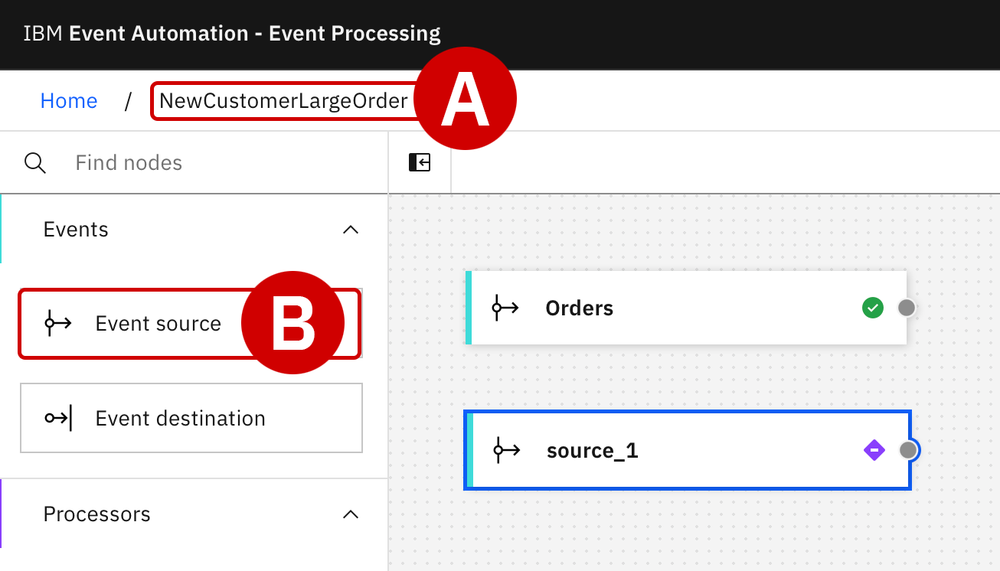
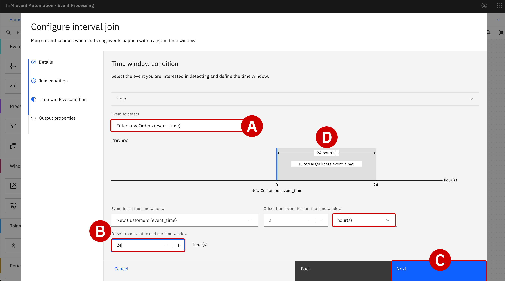
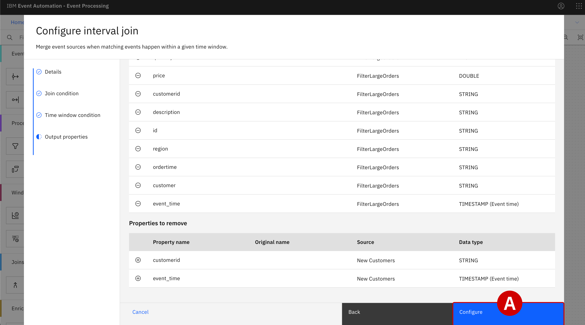

#

!!! quote ""
    Christopher Bienko *(Principal, IBM Global Sales Enablement)* provides a hands-on demonstration of Module 3.

    **Additional ways to watch:** <a href="https://ibm.seismic.com/Link/Content/DCjdpcfpj2DC68qT3Hppp34MPRQj" target="_blank">Seismic replay available for download.</a> [14 minutes]

<br/>

## **i. Using Event Processing no-code editors for configuration**

Focus Corporation's marketing department now has a fully configured, self-service catalog of event stream data available within **IBM Event Endpoint Management (EEM)**.

At this stage, work will transition from the integration team to the domain of the marketing team. Focus' marketing team will utilize **IBM Event Processing (EP)** to correlate any newly-created customer accounts with first-time purchase orders that total over $100 USD in value. Furthermore, these correlated transactions will need to be identified within a 24-hour window of when they occur.

If these conditions can be met, the marketing team will be able to create an actionable plan for putting high-value promotional offers in front of first-time customers in a timely manner — which should translate to more sales revenue through Focus' digital storefront.

---

1. With your web browser, access the **IBM Event Processing** dashboard.

    Dismiss any welcome screens or tutorials that are prompted after first logging in by clicking the **Hide Welcome**^[A]^ text in the bottom-left corner of the interface.

---

2. In the bottom-right corner of the page, click the blue **Create**^[B]^ to begin defining a new *flow*.

    <br/>

    !!! note inline "EVENT PROCESSING FLOWS"

        An event processing flow ingests a stream of events, analyzes that input, and takes automatic actions (defined by the user) in response to those conditions.

        A flow begins with one or multiple event sources which represent inbound events. For the purposes of this demonstration, you will leverage the `ORDERS` event stream that was defined in the previous module. You will do so using EP's intuitive, no-code authoring canvas.

    {: loading=lazy width="400"}

---

3. For **Name**^[A]^, specify `NewCustomerLargeOrder` and then click **Create**^[B]^.

    <br/>
    {: loading=lazy width="300"}

---

## **ii. Configuring an event source for Orders**

Before the inbound events can be captured, connectivity details for the event source node (`ORDERS`) must be configured within the authoring canvas.

---

4. Wait until the page has refreshed to display the no-code environment.

    - Along the left side are tools and actions that can be dragged into the authoring canvas on the right

    - Within the canvas, you will see an **Event source**^[A]^ node with default name of `source_1`

    - With your cursor, hover over the `source_1` node and then click the **Edit**^[B]^ (pencil) icon in the top-right corner of the tile to begin modifying the node

    <br/>
    {: loading=lazy width="300"}

---

5. The **Configure event source** wizard will load within your browser.

    - Under the *Add an event source or pick a recent one* header, select **Add event source**^[A]^

    - Click **Next**^[B]^

    <br/>
    {: loading=lazy width="600"}

---

6. Switch back to the **Event Endpoint Management** tab and click **Catalog**.

    - Drill down into the `ORDERS`^[A]^ topic by clicking on the name

    - Scroll down the topic summary page until you reach the **Access Information** section

    - Just below, within the *Servers* table, is the full address of the `ORDERS` event topic

    - Copy the *full* address^[B]^ to your notepad for reference later

    - When ready, switch back to the **IBM Event Processing** tab with your web browser

    <br/>
    {: loading=lazy width="600"}

    {: loading=lazy width="600"}

---

7. Back within **IBM Event Processing** service, the *Cluster Connection* tab will ask for details about the Kafka cluster and topic to connect to.

    - *Server*: supply the URL recorded in the previous step (*Step 6*)

    - Click **Next**
    
---

8. The *Access Credentials* tab will ask for connection details to the Kafka topic.

    - Keep the **Select security mechanism** variable as its default value: `PLAIN`
    
    - For **Username**^[A]^ and **Password**^[B]^, supply the credentials for the `ORDERS` topic (*Module 2 - Step 32*)

    - Click **Next**^[C]^

    <br/>
    {: loading=lazy width="600"}
    
---

9. The *Topic Selection* tab needs additional information to configure the node.

    - Available topics will already be displayed within the configuration tool
    
    - Under the *Topic selection* header, click the button next to the `ORDERS`^[A]^ topic to select it

    - Click **Next**^[B]^

    <br/>
    {: loading=lazy width="600"}

---

10. The *Message Format* needs details about the event formatting.

    - *Message format*: set to `JSON`

    - Set the *JSON sample message* field to the value stored below:

    !!! note inline end ""

        Note that this is the same sample schema you supplied when configuring the event source within EEM in Module 2.

    ``` json
    {
    "quantity": 9,
    "price": 197.09,
    "customerid": "a7d1586b-ced1-462f-9e44-14e9e5013540",
    "description": "Composite Oversize 28in Tennis Racket",
    "id": "1eba7af9-b748-4754-b750-3459e589dccf",
    "region": "EMEA",
    "ordertime": "2023-10-24 19:26:04.839",
    "customer": "Reed McKenzie DDS"
    }
    ```

    <br/>
    
    - When ready, click **Next** to proceed

    <br/>
    {: loading=lazy width="600"}

---

11. From the *Key and Headers* tab, you will **NOT** need to map `key` and `headers` to event fields.

    Click **Next** to continue.

---

12. You will have a final opportunity to review and confirm the event source configuration.

    - Set the **Node name**^[A]^ to `Orders`
    - Click **Configure**^[B]^ to finalize the configuration of the `Orders` event source

    <br/>
    {: loading=lazy width="600"}

---

## **iii. Configuring an event source for New Customers**

The configurations performed for the `ORDERS` topic now (Steps 4 – 12) must now be repeated for the `CUSTOMERS` topic.

---

13. Return to the `NewCustomerLargeOrder`^[A]^ canvas and drag a new **Event Source**^[B]^ (from the left-hand interface) into the canvas, placing it just below the `Orders` source.

    With your cursor, hover over the new `source_1` node and then click the **Edit** (pencil) icon in the top-right corner of the tile to begin modifying the node.

    <br/>
    {: loading=lazy width="400"}

---

14. The **Configure event source** wizard will load within your browser.

    - Under the *Add an event source or pick a recent one* header, select **Add event source**^[A]^

    - Click **Next**^[B]^

    <br/>
    {: loading=lazy width="600"}

---

15. Switch back to the **Event Endpoint Management** tab and click **Catalog**.

    - Drill down into the `CUSTOMERS` topic by clicking on the name

    - Scroll down the topic summary page until you reach the **Access Information** section

    - Just below, within the *Servers* table, is the full address of the `CUSTOMERS` event topic

    - Copy the *full* address to your notepad for reference later

    - When ready, switch back to the **IBM Event Processing** tab with your web browser

---

16. Back within **IBM Event Processing** service, the *Cluster Connection* tab will ask for details about the Kafka cluster and topic to connect to.

    - *Server*: supply the URL recorded in the previous step (*Step 15*)

    - Click **Next**
    
---

17. The *Access Credentials* tab will ask for connection details to the Kafka topic.

    - Keep the **Select security mechanism** variable as its default value: `PLAIN`
    
    - For **Username**^[A]^ and **Password**^[B]^, supply the credentials for the `CUSTOMERS` topic (*Module 2 - Step 28*)

    - Click **Next**^[C]^

<br/>
    {: loading=lazy width="600"}
    
---

18. The *Topic Selection* tab needs additional information to configure the node.

    - Available topics will already be displayed within the configuration tool
    
    - Under the *Topic selection* header, click the button next to the `CUSTOMERS`^[A]^ topic to select it

    - Click **Next**^[B]^

    <br/>
    {: loading=lazy width="600"}

---

19. The *Message Format* needs details about the event formatting.

    - *Message format*: set to `JSON`

    - Set the *JSON sample message* field to the value stored below:

    !!! note inline end ""

        Note that this is the same sample schema you supplied when configuring the event source within EEM in Module 2.

    ``` json
    {
    "customerid": "acb3eb65-98a1-45c2-84d4-f5df157862b4",
    "customername": "Emilio Quitzon",
    "registered": "2023-10-24 19:20:35.638"
    }
    ```

    <br/>
    
    - When ready, click **Next** to proceed

---

20. From the *Key and Headers* tab, you will **NOT** need to map `key` and `headers` to event fields.

    Click **Next** to continue.

---

21. You will have a final opportunity to review and confirm the event source configuration.

    - Set the **Node name**^[A]^ to `New Customers`
    
    - Click **Configure**^[B]^ to finalize the configuration of the `New Customers` event source

    <br/>
    {: loading=lazy width="600"}

    {: loading=lazy width="600"}

---

## **iv. Filtering event sources to match specific criteria**

With the event source fully configured within EP, you can now begin tailoring the event processing flow to filter on orders where the value exceeds $100 USD.

---

22. Scroll down within the list of nodes and actions on the left-side interface until you locate the **Filter** node.

    - Click and hold the **Filter**^[A]^ node, then drag it to the authoring canvas on the right
    
    - Position it to the right side of the `Orders` node

---

23. The output terminal for `Orders` needs to be connected as input to the `filter_1` node.

    - With your mouse pointer, hover over the `Orders` node and take note of the grey dot (labelled *Output Port*^[B]^) at the right edge of the tile

    - Click and hold the *Output Port* (right-most) of `Orders` and **drag** it to the *Input Port*^[C]^ (left-most edge) of `filter_1`, then release your hold to complete the circuit

    <br/>
    {: loading=lazy width="600"}

---

24. With the `Orders` event source node connected to the `filter_1` operation node, you must utilize the Filter node's expression builder to remove orders that are *less than* $100 USD in value. This will allow the marketing team's application to target only first-time customers with spending patterns of $100 USD or more.

    Hover over the `filter_1` node with your mouse pointer and click the **Edit**^[D]^ (pencil) icon.

---

25. Within the *Details* tab, specify the value of **Node name** as `FilterLargeOrders`

    When ready, click **Next**.

---

26. The *Define filter* tab will load next. To the right of the **Filter expression** field, click the **Assistant**^[A]^ drop-down menu to expose additional options.

    <br/>
    {: loading=lazy width="300"}

---

27. Event Processing's expression builder will guide you in defining the filter.

    - Property to filter on: `price`

    - Condition: `Is greater than`

    - Value: `100`

    - Click the **Add to expression** button

    - The expression builder will automatically translate your statements into a syntactically-correct filter statement: ` 'price' > 100 `

    - Click the **Configure**^[B]^ button at the bottom of the panel to finalize the filter configuration

    <br/>
    {: loading=lazy width="600"}

---

## **v. Performing a JOIN across two event sources**

The marketing team needs to "JOIN" the filtered `Order` stream data to records of `New Customers` in order to correctly identify first-time purchasers that placed an order for over $100 USD in the last 24 hours. Use EP's authoring canvas to carry out the necessary JOIN operation.

---

28. Back on the canvas for `NewCustomerLargeOrders`, scroll down along the left-hand interface until you locate the **Interval Join**^[A]^ node.

    Drag and drop this node^[B]^ to the far right-hand edge of the authoring canvas.

    <br/>
    {: loading=lazy width="600"}

---

29. With your cursor, hover over the `New Customers` output terminal and locate the *Output Port* (grey) button.

    - Click and hold the `New Customers` *Output Port*^[A]^ edge and **drag** this to the *Input Port*^[B]^ edge of the newly-created `intervalJoin_1` node

    - Release your cursor to finalize the circuit

    <br/>
    {: loading=lazy width="600"}

---

30. Repeat the process, this time connecting the `FilterLargeOrders` node's *Output Port*^[A]^ to the `intervalJoin_1` node's *Input Port*^[B]^.

    At this stage, the input of `intervalJoin_1` should be connected to the outputs of *both* the `FilterLargeOrders` and `New Customers` nodes.

    <br/>
    {: loading=lazy width="600"}

---

31. The JOIN node must now be configured to correlate events based on a shared `customerid` field within the two event streams (`New Customers` and pre-filtered `Orders`).

    With your cursor, hover over the `intervalJoin_1` node and click the **Edit** (pencil) icon.

---

32. Within the *Details* tab, set **Node name**^[A]^ equal to `DetectNewCustomerLargeOrders`

    When ready, click **Next**^[B]^.

    <br/>
    {: loading=lazy width="600"}

---

33. Within the *Join conditions* tab, activate the expression builder by click the **Assistant**^[A]^ drop-down menu. Set the following properties:

    - Specify property from 'New Customers': `customerid`

    - Specify property from 'FilterLargeOrders': `customerid`

    - When ready, click **Add to expression**^[B]^

    - The syntactically-correct JOIN expression will be expressed under the *Define events* field: `'New Customers'.'customerid' = 'FilterLargeOrders'.'customerid'`

    - After you have reviewed the JOIN condition, click **Next**^[C]^

    <br/>
    {: loading=lazy width="600"}

    {: loading=lazy width="600"}

---

!!! note "TRIGGERING EVENTS AND DETECTED EVENTS"

    Two concepts are important to understand at this time: *Triggering events* and *Detected events*.

    - Since the `New Customer` sign-up event must logically occur before a purchase, it is considered a *triggering event*

    - Therefore, when a signal for an `Order` purchase of over $100 (the *detected event*) is received, the JOIN logic condition will be triggered for the two event streams

34. Under the *Time window condition*, you can define the time interval "window" where detected events are considered viable for a promotional offer from the marketing team. To meet the criteria, a purchase of over $100 USD must be made by a first-time customer within a 24 hour window of creating an account.

    - Look for the **Event to detect**^[A]^ field and select the `FilterLargeOrders (event_time)` option from the drop-down menu

    - A *Preview* visualization of the time window interval is rendered within the panel — for now, with no adjustments made, this will appear as a vertical bar at 0 (on the X-axis)

    - Scroll down further to reveal additional attributes to edit

    - *Event to set the time window*: `New Customers (event-time)`

    - *Offset from event to start the time window*: `0` `HOUR(S)`

    - *Offset from event to end the time window*^[B]^: `24` `HOUR(S)`

    - When ready, click **Next**^[C]^

    <br/>
    {: loading=lazy width="600"}

---

The JOIN node's output will be a combination of fields from both the filtered `Orders` and `New Customers` events streams.

Before finalizing the interval join, you need to clean up the output so that duplicate fields (like `customerid` and `event_time`) are not included from the JOIN operation. You have the option of renaming or removing the duplicate fields — but for the sake of this demonstration, you will be removing the fields.

---

35. Within the *Output properties* tab, locate the `customerid`^[A]^ field. There are **two** (duplicate) copies of the same field at this time. Your objective will be to delete **ONE** of the two duplicate records, where the *Source* is labelled as `New Customers`. Preserve the record where *Source* is labelled as `FilterLargeOrders`.

    - Click the round `—` sign to the left of the first `customerid` row, where the *Source* is labelled as "New Customers", to remove the duplicate

    - The result will be only one copy of the `customerid` field in the table
    
    - The red text (*Must be unique*) underlining the field will disappear from the table

    <br/>

    !!! warning inline end "ONLY REMOVE DUPLICATES WHERE SOURCE == NEW CUSTOMERS"

        When reviewing *Output properties* for duplicate fields, take note of the table's **Source** column. Duplicates will be produced by both the `New Customers` and `FilterLargeOrders` nodes. Only remove duplicates where the **Source** is listed as `New Customers`.

    {: loading=lazy width="400"}

---

36. Repeat the procedure for the `event_time` field, which is also duplicated by the JOIN:

    - Delete the `event_time` row where the *Source* column is labelled as "New Customers"

    - With all duplicates removed from the table, the **Configure**^[A]^ button will now be highlighted in blue and selectable

    - Click the **Configure** button to finalize the interval join configuration

    <br/>
    {: loading=lazy width="600"}

    {: loading=lazy width="600"}

---

## **vi. Next steps**

With filtering and processing steps now in place for incoming event streams, Focus Corporation's marketing team is able to detect valid promotional opportunities and emit those detected events to their customer loyalty application. In the following section, you will create those linkages and validate its effectiveness using "live" data feeds.