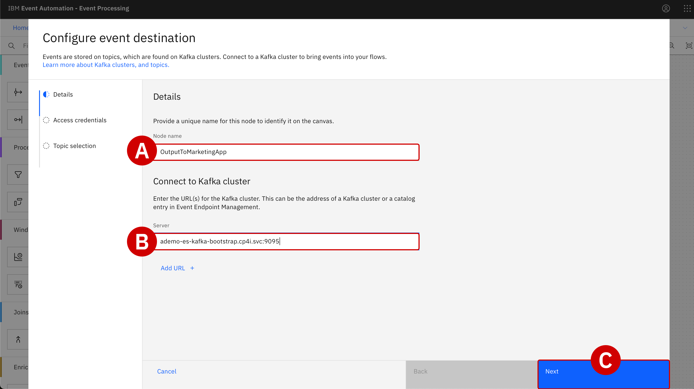
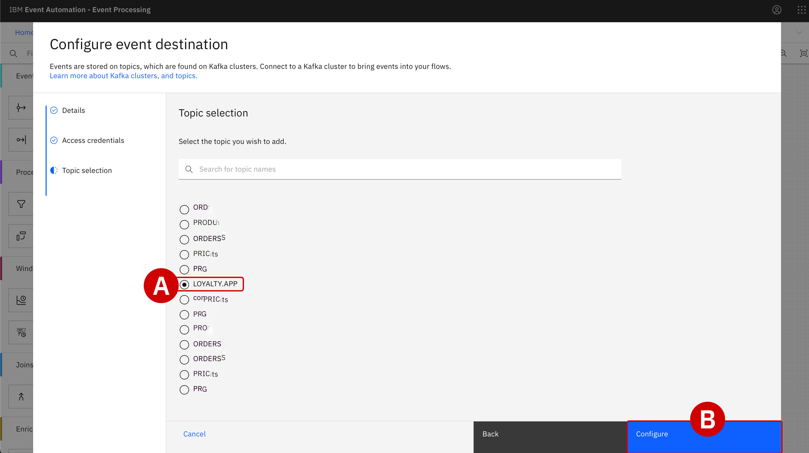

#

!!! quote ""
    Christopher Bienko *(Principal, IBM Global Sales Enablement)* provides a hands-on demonstration of Module 4.

    **Additional ways to watch:** <a href="https://ibm.seismic.com/Link/Content/DCRV97WgRbT9DGWH6VmB6f98H2FB" target="_blank">Seismic replay available for download.</a> [4 minutes]

 

## **i. Connecting real-time events to a marketing application**

It's finally time to unify the hard work of Focus Corporation's integration and marketing teams. With a rich feed of filtered and processed event streams, which joins together `New Customers` and `Orders` data feeds, the marketing department can begin supplying their customer loyalty application with input.

When new events are detected which match the marketing team's promotional criteria, the application will automatically trigger an upsell activity for the new customer.

---

1. Return to the authoring canvas dashboard for `NewCustomerLargeOrders` within the **IBM Event Processing (EP)** tab.

---

2. From the list of nodes along the left-side interface, drag and drop the **Event destination**^[A]^ node into the canvas. Place it far to the right of the other nodes within the table^[B]^. You can use your mouse wheel to resize the table if necessary.

     

    !!! note inline end ""
        The new node `sink_1` represents a "resource", a concept from Apache Kafka. These resources can receive incoming events — thereby serving as a *destination*.

    {: loading=lazy width="450"}

---

3. With your cursor, hover over the `DetectNewCustomerLargeOrders` node that was created in the previous module.

    - Click and drag the node's *Output Port* edge, connecting it to the *Input Port* edge of the `sink_1` node

    - Release the mouse button to establish the connection between the two nodes

---

4. Hover over the `sink_1` node and click the **Edit**^[A]^ (pencil) icon to configure the destination.

     
    {: loading=lazy width="350"}

---

5. Within the *Details* tab, adjust the following variables:

    - **Node name**^[A]^: `OutputToMarketingApp`

    - **Server**^[B]^: `es-demo-kafka-bootstrap.tools.svc:9095` (the value recorded as part of the Kafka SCRAM in *Module 2 - Step 6*)

    - When ready, click **Next**^[C]^

     

    !!! note inline end ""
        The server has been pre-configured as part of the hands-on lab Setup module, generating the Apache Kafka events that will simulate both "historical" and "live" customer interactions with Focus' online store and payment gateway.

    {: loading=lazy width="400"}

---

6. Within the *Access credentials* tab, modify the following variables to match the Kafka SCRAM details recorded in *Module 2 - Step 6*:

    - **Username**^[A]^: `es-demo`

    - **Password**^[B]^: your unique password

    - When ready, click **Next**^[C]^

     
    {: loading=lazy width="600"}

---

7. Within the *Topic selection* tab, you will be asked to specify which of the available endpoints topics should serve as a destination "sink."

    In this situation, the goal is to send all valid customer interactions (which meet the purchasing criteria) to the marketing department's customer loyalty application.

    - Select the `LOYALTY.APP` topic^[A]^ - you may need to tab through the pages (3 total), or expand the number of *Items per page* to 15

    - Click **Configure**^[B]^ to finalize the event destination

     
    {: loading=lazy width="600"}

    {: loading=lazy width="600"}

---

## **ii. Test using historical event data**

You are now ready to begin testing the end-to-end flow using historical event data. This will allow the marketing and integration teams to see the results of the flow and validate the results.

If successful, several new customers who are eligible for the promotional discount should be detected and flagged within the loyalty application.

---

8. Return to the authoring canvas dashboard for `NewCustomerLargeOrders` within IBM Event Processing (EP).

    - In the top-right corner of the interface, click the **Run** drop-down menu

    - From the list of options, select **Include historical**^[A]^

     
    {: loading=lazy width="300"}

---

9. Detected events will begin automatically populating the **Output Events** panel, along the bottom of the page.

    - It will take a few moments for the events to begin populating the table

    - After several hours, the table will be populated with pages of entries (cycle through these using the arrows or drop-down page selector)
    
    - Continue to verify the detected events until satisfied with the historical event data results

    - When ready, stop the flow by clicking the **Stop** button in the top-right corner of the page

    ??? warning "TROUBLESHOOTING — *UNABLE TO CONNECT TO RESULTS*"

        You may experience a pop-up window in the top-right corner of the authoring canvas after initiating a *Run* execution. This is expected given that not all of the Kafka topic endpoints were configured — you only configured the `LOYALTY.APP` endpoint, as well as the `ORDERS` and `CUSTOMERS` event streams.
        
        You can safely ignore this warning and click the *X* icon to dismiss it.

         
        {: loading=lazy width="300"}

    

---

## **iii. Conclusion**

Having successfully tested the flow, Focus Corporation is ready to reconfigure the event destination sink and begin feeding live event stream data into their production environment. Afterwards, it will immediately begin generating actionable promotions within Focus Corporation's customer loyalty application.

Congratulations on a successful demonstration! This concludes the hands-on material. At this time, you should be ready to record a **Stand & Deliver** presentation or complete the business partner **skills evaluation quiz** — follow the <a href="https://ibm.github.io/Event-Automation-L3/evaluation/" target="_blank">Evaluation</a> steps appropriate to your job role.