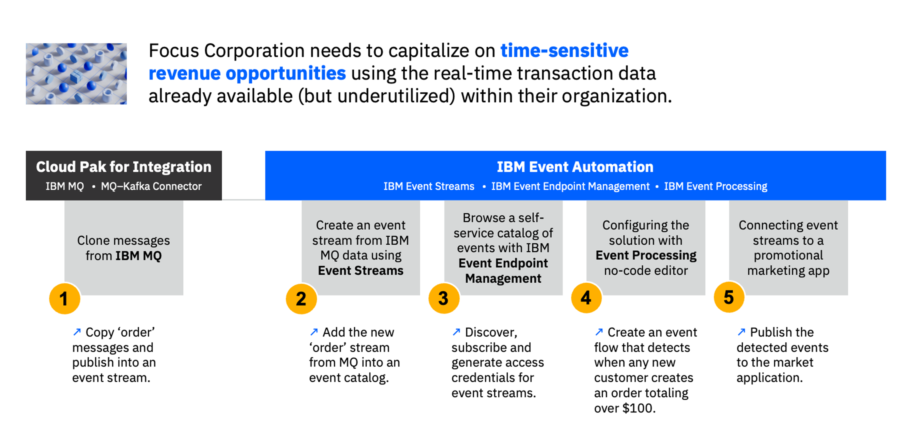

!!! quote ""
    
    **Christopher Bienko** *(Principal, IBM Global Sales Enablement)* introduces the objectives and curriculum for *IBM Event Automation for Technical Sales Level 3*.

    **Additional ways to watch:** <a href="https://ibm.seismic.com/Link/Content/DCB62pRqMG7jHGT2P6TRjF9b6qF8" target="_blank">Seismic replay available for download.</a> [4 minutes]

#
# **Integration** that weaves together both applications and systems is essential to the success of a modern, digital enterprise.

In 2024 and beyond, the enterprise organizations that outpace and outcompete in their marketplace will be those that are the most responsive, agile, and adaptable to an ever-shifting and increasingly-connected IT landscape. The success of these organizations will depend on their ability to securely connect, automate, and transform their business at scale — made possible through the integration of real-time messaging, events, and processes.

Conceptually, it's useful to examine these requirements across three domain areas (which so happen to map to the three pillars of the IBM Integration solution portfolio):

- **Event-led integration**: For enterprise to discover what is happening within their business and quickly respond to emergent events.
    
- **API-led integration**: For enterprise that needs to access and share information, both securely and rapidly.

- **Messaging and connectivity**: For enterprise to securely and reliable access or update Systems of Record, at scale.

---

#
# Organizations of every size, across all industries and verticals, face a **shared set of challenges** in their adoption of event-driven architectures and enterprise-wide integration.

Enterprise organizations (and many IBM clients) are at different stages in their event-driven journey. For some, they have only recently embarked on scoping and putting into place an event messaging distribution layer. Others already have in place the foundations for an Apache Kafka-based event distribution layer and are looking to add capabilities that boost security, enable governed self-service access, and incorporate event processing.

Despite the range of industries that must confront the challenges of event-driven architectures and integration, there are four common themes that regularly emerge in conversations with prospective clients:

 

1. **Real-time access for meeting customer demands and taking action in the moment.**
    
    Event-driven enterprises must be optimized, timely, adaptable, and proactive. Event-driven integration and automation provides continuous awareness for a business about the state of their systems and services. It drives automation that responds to events for any situation and enables a more adaptable approach to situations evolving in real-time.

    ??? note "EVENT-LED INTEGRATION SOLUTIONS FROM IBM"

         

        **IBM Event Automation** puts business events to work by making it possible for users to detect unfolding situations and make automated decisions in real-time. The offering consists of three core, composable capabilities:

        - **Event Streams**: *"Event distribution."* Collect real-time business events data streams using an enterprise-grade Apache Kafka distribution. Event sources can include Kafka Connect (IBM MQ or databases), REST APIs, and direct integrations (IBM App Connect, Change Data Capture, and more).

        - **Event Endpoint Management**: *"Event discovery."* Build a self-service catalog of event sources for other users within the business to securely browse and leverage.

        - **Event Processing**: *"Event processing."* Define business situations requiring automated responses ahead of time, using an intuitive authoring canvas that can be invoked in real-time to automate decision making and take decisive actions. To take raw events and make them contextually relevant to business users, Event Processing can: filter and transform event properties; combine events to identify novel patterns over continuous time windows; and aggregate events to analyze trends or detect anomalies.

---

2. **Multiplicity of data sources, all of which a business may need access to.**

    The ever-increasing number of data sources that an enterprise organization connects to provides an expanding surface area for malicious agents to exploit. Moreover, maintaining and managing these data sources becomes increasingly complex as more endpoints are connected to an enterprise's IT estate.
   
    +

3. **Secure access across the organization.**

    Every enterprise has a plethora of unique APIs that are continuously updating. APIs are a specific vector that attackers can exploit for gaining unauthorized access to systems and data. Two-thirds of cloud incidents are due to misconfigured API endpoints.

    ??? note "API-LED INTEGRATION SOLUTIONS FROM IBM"

         

        The combined challenges of managing across a multiplicity of data sources and securing access to that data is addressed by the core competencies of **IBM App Connect** and **IBM App Connect Enterprise**.

         

        **IBM App Connect** allows clients to quickly build and test integration flows with frequently-used authoring tools. It securely connects with hundreds of cloud and on-premises applications via pre-built smart connectors and templates. App Connect's high performance transformation engine virtually supports any-to-any data formats (augmented with AI tooling to assist non-specialists.) It is used to easily deploy integrations with visibility into flow health and performance, for managing across hybrid cloud environments.

        - IBM App Connect supports over 200 OOTB connectors and templates for jumpstarting integration. Automation Explorer provides a <a href="https://explorer.automation.ibm.com" target="_blank">community for connectors and templates</a>. Clients can build their own bespoke systems connectors using an <a href="https://explorer.automation.ibm.com/cdk" target="_blank">accelerated Connector Development Kit</a>.

        - Once connections have been established to the endpoints across an enterprise, API-fed data must be shared (externally or internally) in order to be acted upon. From the moment these APIs are created, they must be managed and secured by a governance and control framework; it is here that API management plays a critical role.

         

        **API-led integration** is the cutting edge way to integrate applications and data by leveraging reusable REST APIs. Via IBM App Connect, the API-led integration approach brings together the disciplines of API management and API integration, across on-premises and cloud.
        
        - First, clients build an integration flow for their APIs using an OpenAPI editor for authoring gateway policies that will govern OpenAPI documents. IBM's all-in-one flow editor provides a unified API authoring experience that brings together "application integration" and "API management" into a single tool.
            
        - By contrast, other integration products require different tools, with differing experiences, to be performed by different users. IBM App Connect makes it possible to define an OpenAPI, build an integration flow, secure it with gateway policies, as well as manage and publish it to a developer portal for re-use — all within a unified editor.

        - IBM App Connect's partnership with <a href="https://nonamesecurity.com" target="_blank">Noname Security</a> helps identify undiscovered API exposure and API Connect's integration with <a href="https://www.ibm.com/docs/en/cloud-private/3.1.2?topic=services-datapower-gateway" target="_blank">IBM DataPower Gateway</a> provides real-time threat and anomaly detection using AI. Clients can utilize <a href="https://stepzen.com" target="_blank">StepZen</a> to rapidly federate a variety of back-end data sources using highly responsive GraphQL APIs (declaratively defined, developer-friendly).

---

4. **Access to a diverse range of development and runtime execution platforms.**

    Endpoints requiring access may include cloud-native application frameworks (containers and microservices), public cloud infrastructure, software-as-a-service (SaaS) applications, software-defined or hyperconverged infrastructure configuration, on-premises implementations of public cloud services, or consumption-billed infrastructure resources. This is not an exhaustive list.

    ??? note "MESSAGING AND CONNECTIVITY SOLUTIONS FROM IBM"

         
        
        The challenges of integrating across a diverse range of messaging and connectivity endpoints is addressed by a range of IBM technologies: **IBM Cloud Pak for Integration**, **IBM App Connect + API Connect** software, and **IBM App Connect + API Connect as a Service** (on IBM Cloud.)

         

        **IBM Cloud Pak for Integration** runs atop Red Hat OpenShift: a vendor-agnostic, containerization platform that is truly hybrid cloud — deployable on nearly every on-premises and cloud infrastructure topology. The offering packages together: API management, application integration, end-to-end security, enterprise messaging, event streaming, and high speed data transfers. It provides a unified place for developers, lines of business, and IT operators to catalog, document, and manage services through a single portal. Likewise, all of these services are bundled and licensed together; there is no need to decide what capabilities are required up-front and clients only pay for how much integration is deployed.

         

        **"Integration Assemblies"** simplify and automate the deployment of new integrations using the IBM Cloud Pak for Integration. Users can create and manage multiple integration instances as a single object. These instances can be immediately granted high availability (HA) if required. Declarative deployments reduce the complexity of manual integration tasks and rapidly increase the rate at which a business can make new API deployments.

         

        **"Operator-deployed container images"** take advantage of Red Hat OpenShift's powerful Operators, reducing the complexity of deploying containerized applications, updating images without disruption, and increasing the resiliency of live containers.

---

#
# Using **IBM Event Automation** to capitalize on time-sensitive revenue opportunities.

**Focus Corporation**, a hypothetical retail company engaged with IBM, is highly motivated to derive more revenue from first-time customers to their online storefronts. Focus' marketing department believes that sending high-value promotions to new customers immediately after they make a large purchase can significantly boost the company's revenue streams. The challenge is finding a way to capitalize on these *time-sensitive* revenue opportunities using the real-time transaction data already available (but underutilized) to Focus' IT department.

 

Focus is currently using IBM MQ to exchange customer orders (placed online) between two endpoints: an order management system and the online payment gateway. As part of the hands-on work to be performed, IBM and Focus integration teams will need to tap into IBM MQ communications and publish each order as a Kafka-based "event stream". This will enable business-critical communications originating over MQ to be captured as events within Kafka topics, which can later be shared across the enterprise for fueling more responsive applications.

Ultimately, Focus' marketing department will be able to use a self-service catalog for inspecting `Order` and `New Customer` topics as needed. From there, they will leverage no-code editors to build automated process flows that detect new customer orders totaling over $100 and issue high-value promotions to the customer's inbox immediately following the purchase.

---

#
# Next Steps

In the following module, review the necessary pre-requisites and setup instructions for getting started with *IBM Event Automation* and *IBM Cloud Pak for Integration* environments.