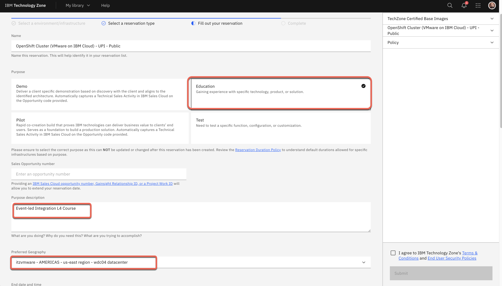
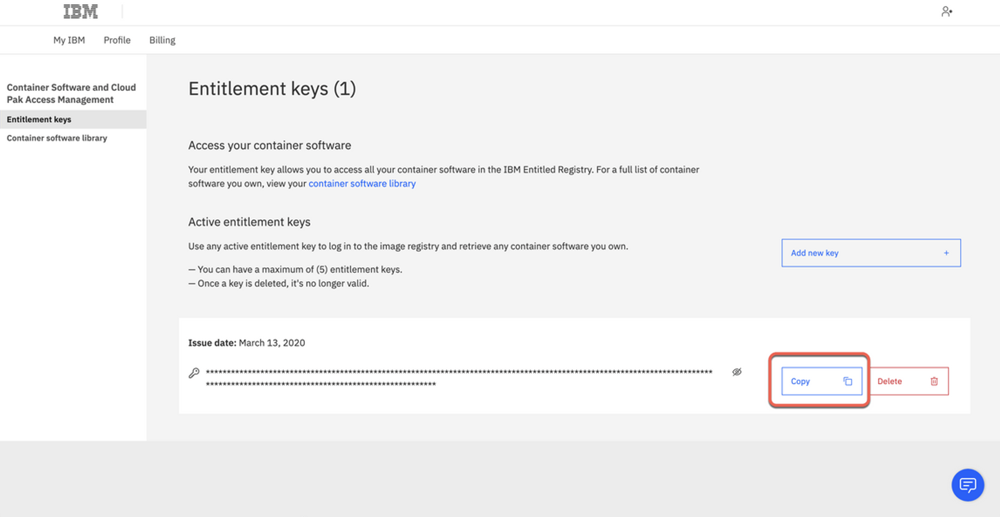

#
!!! warning "TIME ESTIMATES FOR SETUP"

    The following section will take approximately **3 to 4 hours** to complete. Budget your time accordingly.
    
    - Roughly 1 hour of time to reserve and provision an Red Hat OpenShift (OCP) cluster from IBM Technology Zone
    
    - An estimated 3 hours of time to manually install and deploy IBM Event Automation (and IBM Cloud Pak for Integration) on to the OCP cluster

!!! note "SUPPORT AND TROUBLESHOOTING"

    If you require assistance or run into issues with the hands-on lab, help is available.

    - **Environment issues**: The lab environment is managed by IBM Technology Zone. <a href="https://techzone.ibm.com/help" target="_blank">Opening a support case ticket</a> is recommended for issues related to the hands-on environment (provisioning, running, and so on.)

    - **Documentation issues**: If there is an error in the lab documentation, or if you require additional support in completing the material, open a thread on the <a href="https://ibm.enterprise.slack.com/archives/C06NY5ZGXPY" target="_blank">#l3-support-app-modernization</a> Slack channel.

<br/>

## **i. Environment summary**

<br/>


---

The hands-on material covered within this lab will focus on *event-led integration* solutions, specifically the **IBM Event Automation** (EA) suite — as well as elements of the **IBM Cloud Pak for Integration** (CP4I) MQ-Kafka connector.

IBM Event Automation provides an open, composable set of capabilities that interoperate with the services and tools that are already part of many enterprise IT departments. A fundamental component to IBM Event Automation's architecture is composability, which will be highlighted through the lab as you incrementally add more capabilities and elements to the demo environment.

- **Event Endpoint Management**: facilitates secured exposure of event streams and unite all event streams (including MQ and Kafka) into a single, comprehensive view. Focus' marketing department can discover, subscribe to, and generate security credentials for colleagues using the self-service catalog.  Manual processes will be automated and onboarding of users can be expedited.

- **Event Processing**: a no-code editor for allowing developers (of any skill level) to construct processing flows, detect situations across multiple events inside a configurable time-window, and validate flow behavior prior to deploying into production (using historical data.)

- **Event Streams** + **Kafka-MQ connector**: part of the *IBM Cloud Pak for Integration* suite, this connector allows *IBM MQ* messages to be published into a Kafka-compatible event stream. It provides assurances that all MQ messages are delivered once-and-only-once, without requiring complex or custom code.

Environment templates (images) have been defined ahead of time with the assistance of **IBM Technology Zone** (ITZ), which can be reserved for learning and client demonstration purposes at no-charge. Some further configuration of these environments will be required after deployment.

---

## **ii. Prerequisites**

This product is being developed and continuously updated in an agile manner. In addition to adding new capabilities, upgrades to the product are likely to result in changes to the user interface over time. As such, the screenshots used in this lab may not always look exactly like what you see in the latest version of product. These differences should not affect how the lab is executed, and the authoring team will do their best to keep things up to date, but be aware that screenshots or steps may differ slightly with your environment.

Before reserving an environment with ITZ, first ensure that **all** of the following services and frameworks are available on your local machine. These will be needed to begin deployment and installation of the EA and CP4I suite on top of the OCP cluster.

- <a href="https://docs.redhat.com/en/documentation/red_hat_build_of_microshift/4.14/html/cli_tools/microshift-oc-cli-install#cli-installing-cli_cli-oc-installing" target="_blank">oc CLI v4.6+</a>
- <a href="https://cli.github.com/" target="_blank">GitHub CLI</a>
- <a href="https://www.oracle.com/br/java/technologies/downloads/" target="_blank">Java v8+</a>
- <a href="https://www.misterpki.com/install-keytool/" target="_blank">keytool</a>
- <a href="https://github.com/openssl/openssl" target="_blank">openssl</a>
- <a href="https://mailtrap.io/" target="_blank">mailtrap</a>

Instructions and resources for prerequisites setup are provided in each of the hyperlinks.

You will require access to the ITZ in order to reserve your environment and complete the lab. If you do not yet have access or an account with the ITZ, <a href="https://techzone.ibm.com/" target="_blank">you will need to register for one</a>.

The hands-on environment— a combination of services from *IBM Cloud Pak for Integration* (CP4I) and *IBM Event Automation* (EA) —will be running entirely atop of **Red Hat OpenShift**, which will orchestrate containerized deployments of CPI and EA across the OpenShift cluster.

For more details about CP4I's installation procedure, reference the <a href="https://www.ibm.com/docs/en/cloud-paks/cp-integration/2022.4?topic=installing-overview-installation" target="_blank">product documentation</a>.

---

## **iii. Deploying the OCP cluster**

1. Reserve a Red Hat OpenShift Container Platform (OCP) cluster via **ITZ**.

    !!! warning ""

        **URL:** **<a href="https://techzone.ibm.com/my/reservations/create/63a3a25a3a4689001740dbb3" target="_blank">https://techzone.ibm.com/my/reservations/create/63a3a25a3a4689001740dbb3</a>**
    
    - From the `Single environment reservation options` list, select **Reserve now**^[A]^
    - Configure the following **fields** in the reservation template to the values as described in the table below
    - All other fields from the ITZ template, if not listed in the table below, should be kept at their *default* values


    | Field                 | Value                                                                                                                               |
    | --------------------- | ----------------------------------------------------------------------------------------------------------------------------------- |
    | `Purpose`             | If reserving for L3 or L4 training, select *Education*. If delivering a PoC, select *Pilot* and provide a Sales opportunity number. |
    | `Purpose Description` | If reserving for L3 or L4 training, enter *Event-led Integration Training*. If delivering a PoC, enter the PoC and client details.  |
    | `Preferred Geography` | Select your preferred geography.                                                                                                    |
    | `OpenShift Version`   | 4.15                                                                                                                                |
    | `Worker Node Count`   | 5                                                                                                                                   |
    | `Worker Node Flavor`  | 16 vCPU x 64 GB - 100 GB ephemeral storage                                                                                          |
    | `Storage`             | ODF – 2TB                                                                                                                           |

    <br/>
    !!! note inline end "FULLSCREEN IMAGES"
        Click on any of the screenshots within this documentation to enlarge the image.
    {: loading=lazy width="400"}
    
    {: loading=lazy width="600"}
    
    {: loading=lazy width="600"}

---

2. When satisfied, verify that you agree to the *Terms and Conditions* for the environment and finalize your reservation request by clicking **Submit**.

    <br/>
    {: loading=lazy width="600"}


---

3. You will receive an ITZ email confirming that the instance is provisioning.

    <br/>

    !!! note inline end "PROVISIONING TIMES"
    
        Reservations take approximately **30 to 60 minutes** to complete from the time that you click submit. If you navigate to the **<a href="https://techzone.ibm.com/my/reservations" target="_blank">My Reservations</a>** tab of the ITZ, you can monitor the progress of the reservation. Wait for the ITZ reservation to be marked as "*Ready*" before attempting to start the lab — accessing it too soon will lead to issues (or an outright failure) when connecting to OpenShift.

    {: loading=lazy width="400"}
    

---

4. You will receive a second email once the environment is provisioned and the reservation status will now show as *Ready*. Click on **Reservation ID** to open the details page for the new OCP environment.

    <br/>
    {: loading=lazy width="600"}

---

5. Save for reference the *Cluster Admin Username*^[A]^, *Cluster Admin Password*^[B]^, and *OCP Console*^[C]^ link.

    <br/>
    {: loading=lazy width="600"}

---

## **iv. Accessing the OCP cluster**

In this section, access the OpenShift cluster and install the OpenShift command line tool (CLI).

1. In a web browser, open the OCP Console link and paste the *Cluster Admin Username*^[A]^ and *Password*^[B]^ from the previous step and click **Log in**^[C]^.

    <br/>

    !!! warning inline end "THIS CONNECTION IS NOT PRIVATE"

            Depending on your web browser, you may receive a warning about `This connection is not private` or a similarly phrased message. Disregard these warnings and continue to the intended destination by clicking *"visit this website."*

    {: loading=lazy width="450"}

---

2. Copy the login command to access the cluster by CLI. In the top right, click your username^[A]^ and select **Copy login command**^[B]^.

    <br/>
    {: loading=lazy width="600"}

---

3. Click **Display Token**.

    <br/>
    {: loading=lazy width="600"}

---

4. Copy the *Log in with this token* command and paste into a Terminal window. Now you are ready for the Cloud Pak for Integration (CP4I) installation. 

    <br/>
    {: loading=lazy width="600"}
    {: loading=lazy width="600"}

---

## **v. Cloning repositories**

You will need to clone the demo repository to your workstation.

1. Open a terminal window and run the command below. It is recommended you do so in a directory like `/Desktop` so that you can easily locate the files afterwards.

    - First, authenticate your Terminal with the IBM GitHub repository with the following command:
    
    ``` shell
    gh auth login --hostname github.ibm.com
    ```

    - Within the Terminal window, navigate through the following prompts:

        1. *What is your preferred protocol for Git operations on this host?* : `HTTPS`
        2. *Authenticate Git with your GitHub credentials?* : `Yes`
        3. *How would you like to authenticate GitHub CLI?* : `Login with a web browser`
        4. Terminal will generate a one-time code : copy this to a notepad
        5. Within your web browser, log in using your GitHub credentials
        6. Supply the one-time code and approve access to GitHub
        7. Wait until the Terminal window reports back a successful `Logged in as...`

---

2. Execute the following within Terminal to clone the demo repository:
    
    ``` shell
    gh repo clone github.ibm.com/joel-gomez/cp4i-demo
    ```

---

3. Navigate to the `cp4i-demo` folder:

    ``` shell
    cd cp4i-demo
    ```

---

## **vi. Setting context**

Based on where you have deployed the OCP cluster you will need to set up some environment variables to inform the installation script about your environment. 

1. Define an environment variable to set the CP4I version:

    ``` shell
    export CP4I_VER=16.1.0
    ```

---

2. Set the OCP type based on the storage classes in the cluster. If using a ROKS cluster, use `export OCP_TYPE=ROKS` instead.

    ``` shell
    export OCP_TYPE=ODF
    ```

---

3. Set *mailtap* credentials, substituting `<my-mailtrap-user>` and `<my-mailtrap-pwd>` with the variables you set during the **1. Prerequisites** section.

    ``` shell
    export MAILTRAP_USER=<my-mailtrap-user> 
    export MAILTRAP_PWD=<my-mailtrap-pwd>
    ```

---

4. If you have provisioned the OCP cluster in Tech Zone you can use the following script to set the proper default storage class.

    ``` shell
    scripts/99-odf-tkz-set-scs.sh
    ```

---

5. The cluster will also need access to pull the container software required to deploy the Cloud Pak. Your *Entitlement Key* is used to grant access. You can download your entitlement key from <a href="https://myibm.ibm.com/products-services/containerlibrary" target="_blank">My IBM</a>.

    Click **Copy** and record the entitlement key to a notepad.

    <br/>
    {: loading=lazy width="600"}

    ??? warning "NO ACTIVE ENTITLEMENT KEY"
        If no active entitlement keys are available, you can create one by clicking the **Add new key** button. If you receive an "Operation could not be completed at this time", try clicking the button a second or third time until one is generated.

---

6. The IBM Entitled Registry contains software images for the capabilities in IBM Cloud Pak for Integration. To allow the Cloud Pak for Integration operators to automatically pull those software images, you must first obtain your entitlement key, then add your entitlement key in a pull secret. Replace `<my-key>` with your *IBM entitlement key* and then execute:

    ``` shell
    export ENT_KEY=<my-key>
    ```

---

7. Now, you need to define a *namespace* where you will deploy the different capabilities.

    ``` shell
    scripts/02a-cp4i-ns-key-config.sh
    ```

---

## **vii. Installing IBM Cloud Pak foundational services**

The IBM Cloud Pak foundational services operator is no longer installed automatically. Install this operator manually if you need to create an instance that uses identity and access management (IAM). The following steps will walk you through this process.

1. First you need a certificate manager, otherwise the IBM Cloud Pak foundational services operator installation will not complete.

    !!! note ""
        **Time to install**: *~1 minute*

    ``` shell
    oc apply -f resources/00-cert-manager-namespace.yaml
    oc apply -f resources/00-cert-manager-operatorgroup.yaml
    oc apply -f resources/00-cert-manager-subscription.yaml
    ```

    Confirm the subscription has been completed successfully before moving to the next step running the following command.

    ``` shell
    SUB_NAME=$(oc get deployment cert-manager-operator-controller-manager -n cert-manager-operator --ignore-not-found -o jsonpath='{.metadata.labels.olm\.owner}');if [ ! -z "$SUB_NAME" ]; then oc get csv/$SUB_NAME -n cert-manager-operator --ignore-not-found -o jsonpath='{.status.phase}';fi;echo
    ```

    Wait for a response of  `Succeeded`.
    
    ??? warning "NO RESPONSE"
        If no response is generated, **wait a couple of minutes** and try again. Do not proceed until receiving the `Succeeded` prompt.

---

2. Install the Common Services Catalog source.

    !!! note ""
        **Time to install**: *~1 minute*

    ``` shell
    oc apply -f catalog-sources/${CP4I_VER}/02-common-services-catalog-source.yaml
    ```

    Confirm the catalog source has been deployed successfully before moving to the next step running the following command.

    ``` shell
    oc get catalogsources opencloud-operators -n openshift-marketplace -o jsonpath='{.status.connectionState.lastObservedState}';echo
    ```

    Wait for a response of `READY`.

---

3. Create the Common Services namespace.

    ``` shell
    oc new-project ibm-common-services
    ```

---

4. Install the Foundational Services operator (former Common Services).

    !!! note ""
        **Time to install**: *~1 minute*

    ``` shell
    oc apply -f subscriptions/${CP4I_VER}/00-common-service-subscription.yaml
    ```

    Confirm the operator has been deployed successfully before moving to the next step running the following command.

    ``` shell
    SUB_NAME=$(oc get deployment/ibm-common-service-operator -n openshift-operators --ignore-not-found -o jsonpath='{.metadata.labels.olm\.owner}');if [ ! -z "$SUB_NAME" ]; then oc get csv/$SUB_NAME --ignore-not-found -o jsonpath='{.status.phase}';fi;echo
    ```

    Wait for a response of `Succeeded`.

---

## **viii. Deploying the Platform UI**

Deploying the Platform UI allows you to deploy and manage instances from a central location.

1. Install the Platform UI Catalog source.

    !!! note ""
        **Time to install**: *~1 minute*

    ``` shell
    oc apply -f catalog-sources/${CP4I_VER}/03-platform-navigator-catalog-source.yaml
    ```

    Confirm the catalog source has been deployed successfully before moving to the next step running the following command.

    ``` shell
    oc get catalogsources ibm-integration-platform-navigator-catalog -n openshift-marketplace -o jsonpath='{.status.connectionState.lastObservedState}';echo
    ```

    Wait for a response of `READY`.

---

2. Install the Platform UI Operator.

    !!! note ""
        **Time to install**: *~1 minute*

    ``` shell
    oc apply -f subscriptions/${CP4I_VER}/01-platform-navigator-subscription.yaml
    ```

    Confirm the operator has been deployed successfully before moving to the next step running the following command.

    ``` shell
    SUB_NAME=$(oc get deployment ibm-integration-platform-navigator-operator -n openshift-operators --ignore-not-found -o jsonpath='{.metadata.labels.olm\.owner}');if [ ! -z "$SUB_NAME" ]; then oc get csv/$SUB_NAME --ignore-not-found -o jsonpath='{.status.phase}';fi;echo
    ```

    Wait for a response of `Succeeded`.

---

3. Deploy a Platform UI instance.

    !!! note ""
        **Time to deploy**: *~10 minutes*

    ``` shell
    scripts/03a-platform-navigator-inst-deploy.sh
    ```

    Confirm the instance has been deployed successfully before moving to the next step running the following command.

    ``` shell
    oc get platformnavigator cp4i-navigator -n tools -o jsonpath='{.status.conditions[0].type}';echo
    ```

    Wait for a response of `READY`.

    ??? warning "PENDING"
        You may be seeing a response of `PENDING` which indicates the deployment is underway but not yet complete. Wait until the `READY` response is received before continuing.

--- 

4. Once the Platform UI instance is up and running, retrieve the access information by executing the following script.

    ``` shell
    scripts/03b-cp4i-access-info.sh
    ```

    Record the credentials to a notepad for reference later.

---

5. Open the Platform UI URL with a web browser and log in. Note the password is temporary and you will be required to change it. Take note of your new password, as you will use it multiple times throughout the lab.

    <br/>
    {: loading=lazy width="600"}

---

## **ix. Deploying IBM Event Streams**

1. Install the Event Streams Catalog Source.

    !!! note ""
        **Time to install**: *~1 minute*

    ``` shell
    oc apply -f catalog-sources/${CP4I_VER}/08-event-streams-catalog-source.yaml
    ```

    Confirm the catalog source has been deployed successfully before moving to the next step running the following command.

    ``` shell
    oc get catalogsources ibm-eventstreams-catalog -n openshift-marketplace -o jsonpath='{.status.connectionState.lastObservedState}';echo
    ```

    Wait for a response of `READY`.

---

2. Install the Event Streams Operator.

    !!! note ""
        **Time to install**: *~5 minutes*

    ``` shell
    oc apply -f subscriptions/${CP4I_VER}/05-event-streams-subscription.yaml
    ```

    Confirm the operator has been deployed successfully before moving to the next step running the following command.

    ``` shell
    SUB_NAME=$(oc get deployment eventstreams-cluster-operator -n openshift-operators --ignore-not-found -o jsonpath='{.metadata.labels.olm\.owner}');if [ ! -z "$SUB_NAME" ]; then oc get csv/$SUB_NAME --ignore-not-found -o jsonpath='{.status.phase}';fi;echo 
    ```

    Wait for a response of `Succeeded`.

---

3. Deploy the Event Streams instance.

    !!! note ""
        **Time to deploy**: *~5-10 minutes*

    ``` shell
    scripts/08a-event-streams-inst-deploy.sh
    ```

    Confirm the instance has been deployed successfully before moving to the next step running the following command.

    ``` shell
    oc get eventstreams es-demo -n tools -o jsonpath='{.status.phase}';echo
    ```

    Wait for a response of `Ready`.

---

4. Create users.

    ``` shell
    oc apply -f resources/02a-es-initial-config-jgr-users.yaml
    ```

---

## **x. Deploying IBM Event Endpoint Management**

1. Install the IBM Event Endpoint Management (EEM) Catalog Source.

    !!! note ""
        **Time to install**: *~1 minute*

    ``` shell
    oc apply -f catalog-sources/${CP4I_VER}/13-eem-catalog-source.yaml
    ```

    Confirm the catalog source has been deployed successfully before moving to the next step running the following command.

    ``` shell
    oc get catalogsources ibm-eventendpointmanagement-catalog -n openshift-marketplace -o jsonpath='{.status.connectionState.lastObservedState}';echo
    ```

    Wait for a response of `READY`.

---

2. Install the EEM Operator.

    !!! note ""
        **Time to install**: *~5 minutes*

    ``` shell
    oc apply -f subscriptions/${CP4I_VER}/09-eem-subscription.yaml
    ```

    Confirm the operator has been deployed successfully before moving to the next step running the following command.

    ``` shell
    SUB_NAME=$(oc get deployment ibm-eem-operator -n openshift-operators --ignore-not-found -o jsonpath='{.metadata.labels.olm\.owner}');if [ ! -z "$SUB_NAME" ]; then oc get csv/$SUB_NAME --ignore-not-found -o jsonpath='{.status.phase}';fi;echo 
    ```

    Wait for a response of `Succeeded`.

---

3. Deploy EEM Manager instance:

    !!! note ""
        **Time to deploy**: *~5 minutes*

    ``` shell
    scripts/19a-eem-manager-inst-deploy.sh
    ```
    <br/>

    - Wait for a `EEM Manager has been deployed` response before continuing.
    
    - Confirm the instance has been deployed successfully before moving to the next step running the following command:
        ``` shell
        oc get eventendpointmanagement eem-demo-mgr -n tools -o jsonpath='{.status.phase}';echo
        ```
    - Wait for a response of `Running`.

        ??? warning "TROUBLESHOOTING"
        
            The current version may introduce an issue and instead of a positive response at the end of the script you may get the following message: `Something is wrong!`

            <br/>
            {: loading=lazy width="600"}

            If that is the case, then run the following commands to fix the problem:

            ``` shell
            oc exec -it -n tools eem-demo-mgr-ibm-eem-manager-0 -- rmdir /opt/storage/lost+found
            oc delete pod -n tools eem-demo-mgr-ibm-eem-manager-0
            ```

---

4. Now you must **create your own passwords** for EEM administrators and users, then set those to environment variables.

    Replace `<eem-admin-pwd>` and `<es-user-pwd>` with new passwords (of your choosing). Record those passwords to a notepad so that you can reference them later.
    
    Execute the following script, after replacing the variables, to set EEM passwords.

    ``` shell
    export EEM_ADMIN_PWD=<eem-admin-pwd>
    export EEM_USER_PWD=<es-user-pwd> 
    ```

---

5. Configure security for EEM Manager.

    !!! note ""
        **Time to configure**: *~1 minute*

    ``` shell
    scripts/19a-eem-manager-config-sec.sh
    ```

---

6. Deploy the EEM Gateway instance.

    !!! note ""
        **Time to deploy**: *~5 minutes*

    ``` shell
    scripts/19b-eem-gateway-inst-deploy.sh
    ```

    Confirm the instance has been deployed successfully before moving to the next step running the following command.

    ``` shell
    oc get eventgateway eem-demo-gw -n tools -o jsonpath='{.status.phase}';echo
    ```

    Wait for a response of `Running`.

---

7. Integrate EEM and ES instances.

    ``` shell
    scripts/19f-eem-es-config.sh
    ```

---

8. Retrieve the connection details for the deployed Event Endpoint Management (EEM) instance by executing the following script. Record these details to a notepad for future reference.

    ``` shell
    oc get eem -n tools
    ```
    
    !!! warning ""
        **Username**: `eem-admin` | **Password**: the value set for `<EEM-ADMIN-PWD>` earlier in *Step 4*
    
    - Log in to your Event Endpoint Management UI from a supported web browser
    
    - Dismiss the welcome and tutorial messages
    
    - Click the **user icon** in the top-right corner and then click **Profile** from the drop-down
    
    - Within the **Profile** page, click **Create token**
    
    - Set *Token description* to a memorable value (`EEM Token`) and then click **Create**
    
    - Once the new token is generated, click **Copy** and record it to a notepad
    
    - Click *Close* to exit the dialog

---

9. Set the environment variable for EEM token by replacing `<my-eem-token>` with the token copied in *Step 8*:
    
    ``` shell
    export EEM_TOKEN=<my-eem-token>
    ```

---

10. Populate the EEM Catalog.

    ``` shell
    scripts/19e-eem-manager-config.sh
    ```

---

## **xi. Deploying the Enterprise Messaging service**

1. Install the Enterprise Messaging (MQ) Catalog Source.

    !!! note ""
        **Time to install**: *~1 minute*

    ``` shell
    oc apply -f catalog-sources/${CP4I_VER}/09-mq-catalog-source.yaml 
    ```

    Confirm the catalog source has been deployed successfully before moving to the next step running the following command.

    ``` shell
    oc get catalogsources ibmmq-operator-catalogsource -n openshift-marketplace -o jsonpath='{.status.connectionState.lastObservedState}';echo
    ```

    Wait for a response of `READY`.

---

2. Install the MQ Operator.

    !!! note ""
        **Time to install**: *~1 minute*

    ``` shell
    oc apply -f subscriptions/${CP4I_VER}/06-mq-subscription.yaml
    ```

    Confirm the operator has been deployed successfully before moving to the next step running the following command.

    ``` shell
    SUB_NAME=$(oc get deployment ibm-mq-operator -n openshift-operators --ignore-not-found -o jsonpath='{.metadata.labels.olm\.owner}');if [ ! -z "$SUB_NAME" ]; then oc get csv/$SUB_NAME --ignore-not-found -o jsonpath='{.status.phase}';fi;echo
    ```

    Wait for a response of `Succeeded`.

---

3. Set the MQ namespace environment variable.

    ``` shell
    export MQ_NAMESPACE=cp4i-mq
    ```

---

4. Create certificates and extra route.

    ``` shell
    scripts/10a-qmgr-pre-config.sh
    ```

---

5. Create `configmap` with MQ configuration.

    ``` shell
    oc apply -f resources/03c-qmgr-mqsc-config.yaml
    ```

---

6. Deploy the MQ Queue Manager instance.

    !!! note ""
        **Time to deploy**: *~5 minutes*

    ``` shell
    scripts/10b-qmgr-inst-deploy.sh
    ```

    Confirm the instance has been deployed successfully before moving to the next step running the following command.

    ``` shell
    oc get queuemanager qmgr-demo -n tools -o jsonpath='{.status.phase}';echo
    ```

    Wait for a response of `Running`.

---

7. Create `CCDT`.

    ``` shell
    scripts/10c-qmgr-post-config.sh
    ```

---

8. Deploy the MQ Source Connector.

    ``` shell
    oc apply -f resources/02b-es-mq-source.yaml
    ```

---

9. Deploy the MQ Sink Connector.

    ``` shell
    oc apply -f resources/02c-es-mq-sink.yaml
    ```

---

## **xii. Deploying the Event Processing service**

1. Install Apache Flink Catalog Source.

    !!! note ""
        **Time to install**: *~1 minute*

    ``` shell
    oc apply -f catalog-sources/${CP4I_VER}/14-ea-flink-catalog-source.yaml
    ```

    Confirm the catalog source has been deployed successfully before moving to the next step running the following command.

    ``` shell
    oc get catalogsources ibm-eventautomation-flink-catalog -n openshift-marketplace -o jsonpath='{.status.connectionState.lastObservedState}';echo
    ```

    Wait for a response of `READY`.

---

2. Install Apache Flink Operator.

    !!! note ""
        **Time to install**: *~5 minutes*

    ``` shell
    oc apply -f subscriptions/${CP4I_VER}/10-ea-flink-subscription.yaml
    ```

    Confirm the operator has been deployed successfully before moving to the next step running the following command.

    ``` shell
    SUB_NAME=$(oc get deployment flink-kubernetes-operator -n openshift-operators --ignore-not-found -o jsonpath='{.metadata.labels.olm\.owner}');if [ ! -z "$SUB_NAME" ]; then oc get csv/$SUB_NAME --ignore-not-found -o jsonpath='{.status.phase}';fi;echo
    ```

    Wait for a response of `Succeeded`.

---

3. Prepare TrustStore for Event Automation.

    ``` shell
    scripts/20d-ea-truststore-config.sh
    ```

    Wait for a response of `TrustStore for Event Automation has been created.`

---

4. Deploy the Apache Flink instance.

    !!! note ""
        **Time to deploy**: *~5 minutes*

    ``` shell
    oc apply -f instances/${CP4I_VER}/common/21-ea-flink-instance.yaml
    ```

    Confirm the operator has been deployed successfully before moving to the next step running the following command.

    ``` shell
    oc get flinkdeployment ea-flink-demo -n tools -o jsonpath='{.status.jobManagerDeploymentStatus}';echo
    ```

    Wait for a response of `READY`.

---

5. Install the Event Processing (EP) Catalog Source.

    !!! note ""
        **Time to install**: *~1 minute*

    ``` shell
    oc apply -f catalog-sources/${CP4I_VER}/15-event-processing-catalog-source.yaml
    ```

    Confirm the catalog source has been deployed successfully before moving to the next step running the following command.

    ``` shell
    oc get catalogsources ibm-eventprocessing-catalog -n openshift-marketplace -o jsonpath='{.status.connectionState.lastObservedState}';echo
    ```

    Wait for a response of `READY`.

---

6. Install the Event Processing Operator.

    !!! note ""
        **Time to install**: *~5 minutes*

    ``` shell
    oc apply -f subscriptions/${CP4I_VER}/11-event-processing-subscription.yaml
    ```

    Confirm the operator has been installed successfully before moving to the next step running the following command.

    ``` shell
    SUB_NAME=$(oc get deployment ibm-ep-operator -n openshift-operators --ignore-not-found -o jsonpath='{.metadata.labels.olm\.owner}');if [ ! -z "$SUB_NAME" ]; then oc get csv/$SUB_NAME --ignore-not-found -o jsonpath='{.status.phase}';fi;echo
    ```

    Wait for a response of `Succeeded`.

---

7. Deploy the Event Processing instance.

    !!! note ""
        **Time to deploy**: *~5 minutes*

    ``` shell
    scripts/20b-ea-ep-inst-deploy.sh
    ```

    Confirm the instance has been deployed successfully before moving to the next step running the following command.

    ``` shell
    oc get eventprocessing ep-demo -n tools -o jsonpath='{.status.phase}';echo
    ```

    Wait for a response of `Running`.

---

8. Now you must **create your own passwords** for EP administrators and then set that to environment variables.

    Replace `<ep-admin-pwd>` with a new password (of your choosing). Record that passwords to a notepad so that you can reference it later.
    
    Execute the following script, after replacing the variable, to set EP password.

    ``` shell
    export EP_ADMIN_PWD=<ep-admin-pwd>
    ```

---

9. Configure security for Event Processing.

    !!! note ""
        **Time to configure**: *~1 minute*

    ``` shell
    scripts/20b-ea-ep-config-sec.sh
    ```

---

10. Install the `PGSQL` Operator.

    !!! note ""
        **Time to install**: *~5 minutes*

    ``` shell
    oc apply -f resources/12a-pgsql-subscription.yaml
    ```

    Confirm the instance has been deployed successfully before moving to the next step running the following command.

    ``` shell
    SUB_NAME=$(oc get deployment pgo -n openshift-operators --ignore-not-found -o jsonpath='{.metadata.labels.olm\.owner}');if [ ! -z "$SUB_NAME" ]; then oc get csv/$SUB_NAME --ignore-not-found -o jsonpath='{.status.phase}';fi;echo
    ```

    Wait for a response of `Succeeded`.

---

11. Create `configmap` with database configuration.

    ``` shell
    oc apply -f resources/12b-pgsql-config.yaml
    ```

---

12. Deploy a `PGSQL` database instance:

    !!! note ""
        **Time to deploy**: *~5 minutes*

    ``` shell
    oc apply -f resources/12c-pgsql-db.yaml
    ```

    Confirm the instance has been deployed successfully before moving to the next step running the following command.

    ``` shell
    oc get pods -l "postgres-operator.crunchydata.com/role=master" -n tools -o jsonpath='{.items[0].status.conditions[1].status}';echo
    ```

    Wait for a response of `True`.

    ??? warning "TROUBLESHOOTING"
        If you execute the `oc get pods -l...` check too soon, the Terminal will return with an error message similar to the one captured below. Wait approximately 5 minutes and then try the command again. Once PGSQL has been deployed, the Terminal should return a value of `True`.

        ```
        error: error executing jsonpath "{.items[0].status.conditions[1].status}": Error executing template: array index out of bounds: index 0, length 0. Printing more information for debugging the template:
	    template was:
		    {.items[0].status.conditions[1].status}
	    object given to jsonpath engine was:
		    map[string]interface {}{"apiVersion":"v1", "items":[]interface {}{}, "kind":"List", "metadata":map[string]interface {}{"resourceVersion":""}}
        ```

---

13. Execute the following command to retrieve connection details for accessing various components of the IBM Event Automation (EA) instance. Record this information into a notepad for future reference.

    ``` shell
    scripts/20c-ea-access-info.sh
    ```

    Terminal will return connection details for:
    
    - IBM Event Streams
    - IBM Event Endpoint Management
    - IBM Event Processing
    - PostgreSQL Database

---

## **xiii. Launching support scripts**

Additional supporting services are needed to generate results and data for the hands-on lab experience.

1. Navigate outside of the `cp4i-demo` directory first so that the support scripts can be cloned in a separate directory:

    ``` shell
    cd ..
    ```

---

2. Execute the following command to clone (via `git`) the support script repository (`eventautomationl3.git`) to your local machine.

    ``` shell
    git clone https://github.com/ibm-integration/eventautomationL3.git
    ```

---

3. Navigate into the `eventautomationL3` directory.

    ``` shell
    cd eventautomationL3
    ```

---

4. Execute the script below to install the support script services.

    !!! note ""
        **Time to install**: *~10 minutes*

    ``` shell
    ./deploy-helpers.sh
    ```

---

5. Enable the Kafka Connect base.

    !!! note ""
        **Time to deploy**: *~5 minutes*

    ``` shell
    scripts/08c-event-streams-kafka-connect-config.sh
    ```

    Confirm the instance has been deployed successfully before moving to the next step running the following command.

    ``` shell
    oc get kafkaconnects jgr-connect-cluster -n tools -o jsonpath='{.status.conditions[0].type}';echo
    ```

    Wait for a response of `Ready`.

---

6. Enable the Kafka Connector data generator.

    !!! note ""
        **Time to deploy**: *~1 minute*

    ``` shell
    scripts/08e-event-streams-kafka-connector-datagen-config.sh
    ```

    Confirm the instance has been deployed successfully before moving to the next step running the following command.

    ``` shell
    oc get kafkaconnector -n tools
    ```

    After several minutes, you should receive the following response:

    ```
    NAME            CLUSTER          CONNECTOR CLASS     							  MAX TASKS   READY
    kafka-datagen   jgr-connect-cluster   	com.ibm.eventautomation.demos.acme.DatagenSourceConnector   	1           	True
    mq-sink         jgr-connect-cluster   	com.ibm.eventstreams.connect.mqsink.MQSinkConnector         	1           	True
    mq-source       jgr-connect-cluster   	com.ibm.eventstreams.connect.mqsource.MQSourceConnector     	1           	True
    ```

---

## **xiv. Next steps**

Congratulations — you have successfully deployed *IBM Event Automation* and *IBM Cloud Pak for Integration*, as well as the necessary services to run the hands-on lab.

At this stage, use your web browser to open a new tab for each of the services:

- *IBM Cloud Pak for Integration*
- *Event Streams*
- *Event Endpoint Management*
- *Event Processing*
- *IBM MQ*

<br/>
Keep these tabs open. You will be switching between them frequently.

The following module will outline the Level 3 evaluation criteria for IBM technical sellers and business partners. Follow the accreditation steps appropriate to your job role.